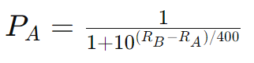
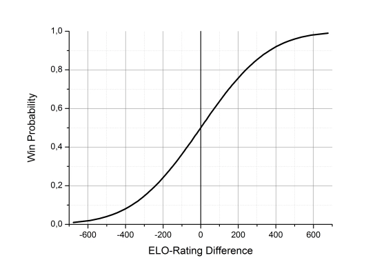

# Elo Pairings

[Try it!](https://christernilsson.github.io/ELO-Pairings/?TOUR=Klass_1&DATE=2024-05-28&PLAYERS=(1825!JOHANSSON_Lennart_B.)(1697!BJÖRKDAHL_Göran)(1684!SILINS_Peteris)(1681!STOLOV_Leonid)(1644!PETTERSSON_Lars-Åke)(1598!AIKIO_Onni)(1598!ISRAEL_Dan)(1583!PERSSON_Kjell)(1561!LILJESTRÖM_Tor)(1559!LEHVONEN_Jouko)(1539!ANDERSSON_Lars_Owe)(1535!ÅBERG_Lars-Erik)(1532!ANTONSSON_Görgen)(1400!STRÖMBÄCK_Henrik)) 

* Players meet players with similar Elo rating
	* This eliminates slaugther games
* Standings are sorted on Quality = ELO improvement
	* Even lower rated can win

## Motivation

[Swiss Matrix](swiss-78.txt)  
[ELO Matrix](elo-78.txt)  

The Swiss Matrix shows the games actually played in a tournament paired with Swiss.  
The ELO Matrix shows which games would actually be played in a tournament paired with ELO Pairings.  
The diagonal is marked with asterisks as players never meet themselves.  
The axes contains the elos of the players.  
The numbers in the matrices are round numbers.  
The Swiss Matrix is quite spread out, which indicates many games with large elo gaps.  

* Upper left corner: the strongest players
* Lower right corner: the weakest players
* Upper right and lower left corner: slaughter corners. Strong meets weak

# How to use the program

## Pages

The are four pages:
* Standings (The final listing ordered by Elo rating)
* Tables    (shows where to sit and also used for entering results)
* Names     (shows where to sit alphabetically)
* Activity  (Pause and activate players)

Navigate between them by clicking with the mouse, using the letters **S**, **T**, **N**, **A** or **Left** and **Right** Arrow.

## Keys

The following keys are available:  
**Up**, **Down**, **Home**, **End**, **PageUp**, **PageDown**  
You can also use the mouseWheel to scroll.  

## Zoom

* In and Out

## Always print the Table Sheets for entering results.

This is your secondary backup!  
You can handle a tournament without a printer, but it is not recommended for larger tournaments  
After pairing, go to the Downloads section of your browser (**ctrl+j**) and open the top file.  
It contains Standings, Names and Tables.  
Print the file, and put up the alphabetical Name sheets, well separated, in the *same* positions every round.  

## Entering Results

* Use **1**, **space** or **0** to enter each result
* Enter the result *twice* to double check
* An erroneous result has to be deleted with the **Delete** key

## Entering results twice

Make a habit of always entering the result twice  
As soon as a score sheet is finished, start entering the results, using the keyboard  
By entering the same results twice, you will reduce the risk of mis-entering  
The erroneous line will be red and you have to delete the result before entering the correct one  

## Standings

* Get detailed information about a game by hovering the mouse
	* You will see the elo and name of the opponent, as well as *quality* and elo difference
* Columns
	* **Pos** - the leader is number 1
	* **Id** - the player identification
	* **Elo** - the players current elo
	* **Name**
	* The rounds
		* Green background - a Win
		* Red background - a Loss
		* Gray background - a Draw
		* White id - white pieces
		* Black id - black pieces
	* **Quality** - the total Elo rating change in all rounds
		* Most changes are approx: Win=10, Draw=0 and Loss=-10 as the elo differences are small. (K=20)
		* A compensation, based on the elo difference will be taken from the stronger and given to the weaker player
		* Players with K=10 (masters) may half the quality to find the correct elo change
		* Players with K=40 (beginners) may double the quality to find the correct elo change

## Downloads

* After each pairing, two files will be saved
	1. A copy of Standings, Names and Tables
	2. An URL containing all data. This is a backup

## Saving the tournament
	* The updated URL contains all information to display the result page
	* No data will be stored on the server. All data is in the URL

# Background information

## Handicap in chess

The main reason for using Handicaps, is to produce unpredictable games.  
Even players will have more fun.  

Traditionally, these handicap variants have been used in chess:  

* *Material*, the stronger player plays without one piece
* *Moves*, the weaker player gets one or more extra moves in the opening
* *Opening*, the stronger player makes one or more weak moves
	* e.g. a4 or h4
* *Clock*, the weaker player gets extra time

The problem with these variants is, they are all unnatural.  

* Handicaps are common in the following sports, just to mention a few:
	* [Golf](https://en.wikipedia.org/wiki/Handicap_(golf))
	* [Sailing](https://en.wikipedia.org/wiki/Handicap_(sailing)#:~:text=The%20handicap%20number%20assigned%20to,be%20behind%20the%20theoretical%20yacht.) 
	* [Go](https://en.wikipedia.org/wiki/Handicapping_in_Go)
	* [Hex](https://en.wikipedia.org/wiki/Hex_(board_game))

## Links

[78 players](https://christernilsson.github.io/ELO-Pairings/?TOUR=Tyresö_Open_2024&DATE=2024-05-03&PLAYERS=(2416!Hampus_Sörensen)(2413!Michael_Wiedenkeller)(2366!Joar_Ölund)(2335!Joar_Östlund)(2272!Vidar_Grahn)(2235!Leo_Crevatin)(2213!Daniel_Vesterbaek_Pedersen)(2141!Victor_Muntean)(2113!Filip_Björkman)(2109!Vidar_Seiger)(2108!Pratyush_Tripathi)(2093!Erik_Dingertz)(2076!Michael_Duke)(2065!Matija_Sakic)(2048!Michael_Mattsson)(2046!Lukas_Willstedt)(2039!Lavinia_Valcu)(2035!Oliver_Nilsson)(2031!Lennart_Evertsson)(2022!Jussi_Jakenberg)(2001!Aryan_Banerjee)(1985!Tim_Nordenfur)(1977!Elias_Kingsley)(1954!Per_Isaksson)(1944!Cristine_Rose_Mariano)(1936!Lo_Ljungros)(1923!Herman_Enholm)(1907!Carina_Wickström)(1897!Joel_Åhfeldt)(1896!Stefan_Nyberg)(1893!Hans_Rånby)(1889!Mikael_Blom)(1886!Joar_Berglund)(1885!Mikael_Helin)(1880!Olle_Ålgars)(1878!Jesper_Borin)(1871!Khaschuluu_Sergelenbaatar)(1852!Roy_Karlsson)(1848!Fredrik_Möllerström)(1846!Kenneth_Fahlberg)(1835!Peder_Gedda)(1833!Karam_Masoudi)(1828!Christer_Johansson)(1827!Anders_Kallin)(1818!Morris_Bergqvist)(1803!Martti_Hamina)(1800!Björn_Löfström)(1796!Nicholas_Bychkov_Zwahlen)(1794!Jonas_Sandberg)(1793!Rohan_Gore)(1787!Kjell_Jernselius)(1783!Radu_Cernea)(1778!Mukhtar_Jamshedi)(1768!Neo_Malmquist)(1763!Joacim_Hultin)(1761!Lars-Åke_Pettersson)(1748!André_J_Lindebaum)(1733!Lars_Eriksson)(1733!Hugo_Hardwick)(1728!Hugo_Sundell)(1726!Simon_Johansson)(1721!Jouni_Kaunonen)(1709!Eddie_Parteg)(1695!Sid_Van_Den_Brink)(1691!Svante_Nödtveidt)(1688!Anders_Hillbur)(1680!Sayak_Raj_Bardhan)(1671!Salar_Banavi)(1650!Patrik_Wiss)(1641!Anton_Nordenfur)(1624!Jens_Ahlström)(1622!Hanns_Ivar_Uniyal)(1579!Christer_Carmegren)(1575!Christer_Nilsson)(1524!Måns_Nödtveidt)(1480!Karl-Oskar_Rehnberg)(1417!David_Broman)(1406!Vida_Radon)) 

[Edit 14](https://github.com/ChristerNilsson/ELO-Pairings/blob/main/tournaments/14.txt)  

[Edit 78](https://github.com/ChristerNilsson/ELO-Pairings/blob/main/tournaments/78.txt)

## Instructions for organizers
* Edit the **URL**
* Add the elos and names of the players
* Fields
	* **TOUR** the header of the tournament. Optional
	* **DATE** the Date. Optional
	* **K**, the development coefficient, 40 for beginners, **20** for ordinary, 10 for expert players. Optional
	* **TPP** Tables Per Page. Default 30. Optional
	* **PPP** Players Per Page. Default 60. Optional
	* **PAUSED** id:s of paused players. Optional
	* **PLAYERS** elos and names, separated with an exclamation sign. Mandatory

## Elo calculation

Elo is calculated using this formula:  

PA = probability of win for player A  
RA = rating for player A  
RB = rating for player B  
	
## Logistics

* The x-axis = RA - RB
* The y-axis = PA

## ELO Calculation

[Calculator](https://christernilsson.github.io/2023-008-Kalkyl/?content=K%20%3D%2020%20%23%20development%20coefficent%0A%0ASD%20%3D%20400%20%23%20Standard%20Deviation%0A%0Adiff%20%3D%201800%20-%201800%20%23%20RA%20-%20RB%0A%0A%5BLOSS,%20DRAW,%20WIN%5D%20%3D%20%5B0,%200.5,%201%5D%0A%0APA%20%3D%20(diff)%20-%3E%201%20/%20(1%20+%2010%20**%20(-diff%20/%20SD))%0A%0Af%20%3D%20(diff,score)%20-%3E%20K%20*%20(score%20-%20PA%20diff)%0A%0APA%20diff%0A%0Af(diff,LOSS)%0Af(diff,DRAW)%0Af(diff,WIN)%0A&config=%7B%22angleMode%22:0,%22language%22:0,%22displayMode%22:0,%22digits%22:2%7D)

## Developer links

[14 players](https://127.0.0.1:5500/?TOUR=Klass_1&DATE=2024-05-28&PLAYERS=(1825!JOHANSSON_Lennart_B.)(1697!BJÖRKDAHL_Göran)(1684!SILINS_Peteris)(1681!STOLOV_Leonid)(1644!PETTERSSON_Lars-Åke)(1598!AIKIO_Onni)(1598!ISRAEL_Dan)(1583!PERSSON_Kjell)(1561!LILJESTRÖM_Tor)(1559!LEHVONEN_Jouko)(1539!ANDERSSON_Lars_Owe)(1535!ÅBERG_Lars-Erik)(1532!ANTONSSON_Görgen)(1400!STRÖMBÄCK_Henrik)) 

[78 players](https://127.0.0.1:5500/?TOUR=Tyresö_Open_2024&DATE=2024-05-03&PLAYERS=(2416!Hampus_Sörensen)(2413!Michael_Wiedenkeller)(2366!Joar_Ölund)(2335!Joar_Östlund)(2272!Vidar_Grahn)(2235!Leo_Crevatin)(2213!Daniel_Vesterbaek_Pedersen)(2141!Victor_Muntean)(2113!Filip_Björkman)(2109!Vidar_Seiger)(2108!Pratyush_Tripathi)(2093!Erik_Dingertz)(2076!Michael_Duke)(2065!Matija_Sakic)(2048!Michael_Mattsson)(2046!Lukas_Willstedt)(2039!Lavinia_Valcu)(2035!Oliver_Nilsson)(2031!Lennart_Evertsson)(2022!Jussi_Jakenberg)(2001!Aryan_Banerjee)(1985!Tim_Nordenfur)(1977!Elias_Kingsley)(1954!Per_Isaksson)(1944!Cristine_Rose_Mariano)(1936!Lo_Ljungros)(1923!Herman_Enholm)(1907!Carina_Wickström)(1897!Joel_Åhfeldt)(1896!Stefan_Nyberg)(1893!Hans_Rånby)(1889!Mikael_Blom)(1886!Joar_Berglund)(1885!Mikael_Helin)(1880!Olle_Ålgars)(1878!Jesper_Borin)(1871!Khaschuluu_Sergelenbaatar)(1852!Roy_Karlsson)(1848!Fredrik_Möllerström)(1846!Kenneth_Fahlberg)(1835!Peder_Gedda)(1833!Karam_Masoudi)(1828!Christer_Johansson)(1827!Anders_Kallin)(1818!Morris_Bergqvist)(1803!Martti_Hamina)(1800!Björn_Löfström)(1796!Nicholas_Bychkov_Zwahlen)(1794!Jonas_Sandberg)(1793!Rohan_Gore)(1787!Kjell_Jernselius)(1783!Radu_Cernea)(1778!Mukhtar_Jamshedi)(1768!Neo_Malmquist)(1763!Joacim_Hultin)(1761!Lars-Åke_Pettersson)(1748!André_J_Lindebaum)(1733!Lars_Eriksson)(1733!Hugo_Hardwick)(1728!Hugo_Sundell)(1726!Simon_Johansson)(1721!Jouni_Kaunonen)(1709!Eddie_Parteg)(1695!Sid_Van_Den_Brink)(1691!Svante_Nödtveidt)(1688!Anders_Hillbur)(1680!Sayak_Raj_Bardhan)(1671!Salar_Banavi)(1650!Patrik_Wiss)(1641!Anton_Nordenfur)(1624!Jens_Ahlström)(1622!Hanns_Ivar_Uniyal)(1579!Christer_Carmegren)(1575!Christer_Nilsson)(1524!Måns_Nödtveidt)(1480!Karl-Oskar_Rehnberg)(1417!David_Broman)(1406!Vida_Radon)) 

## Color handling (same as in Swiss)

* **•o•o•o** or **o•o•o•** is the ideal
* **•o•oo•** happens for most players
* **••** never happens
* **o••** may happen 
* Same color only possible after *even* number of rounds. 
* Number of blacks minus number of whites is always one of -1, 0 or 1
